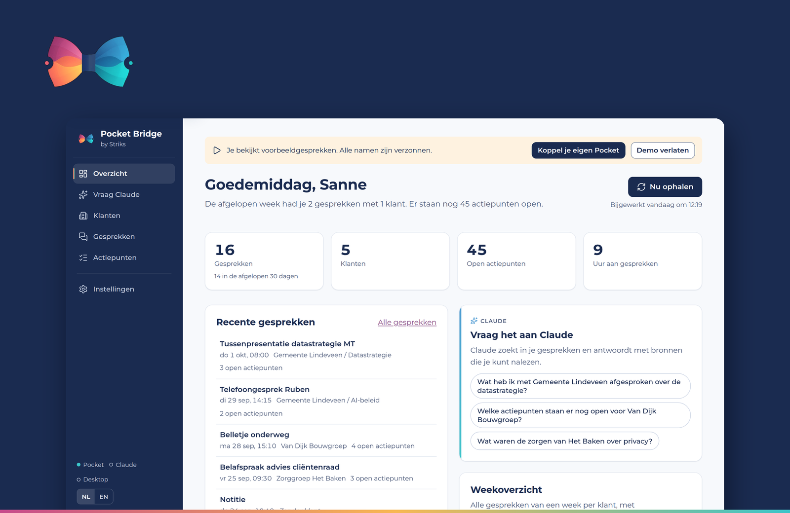
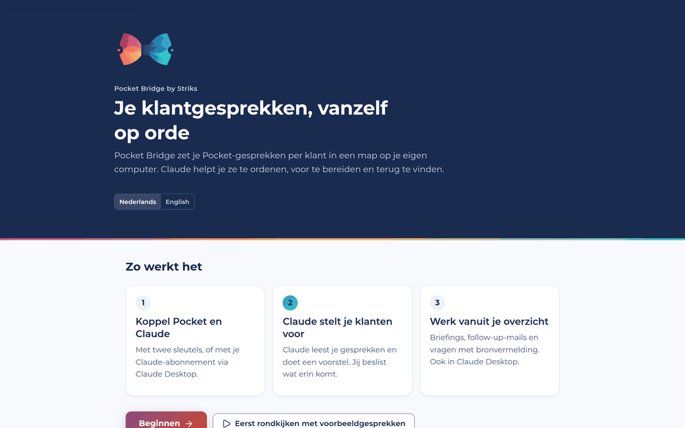
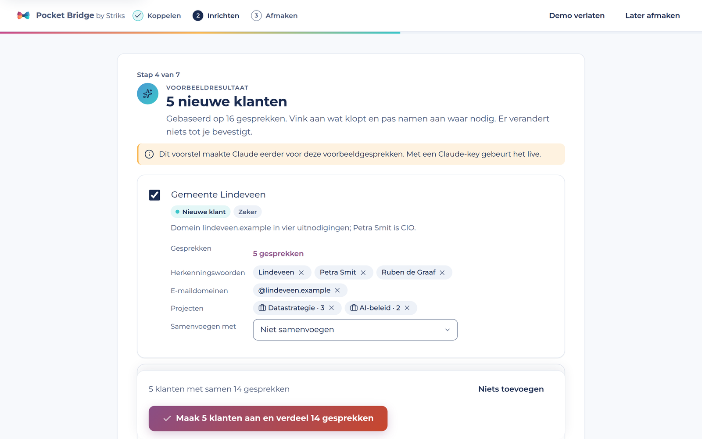
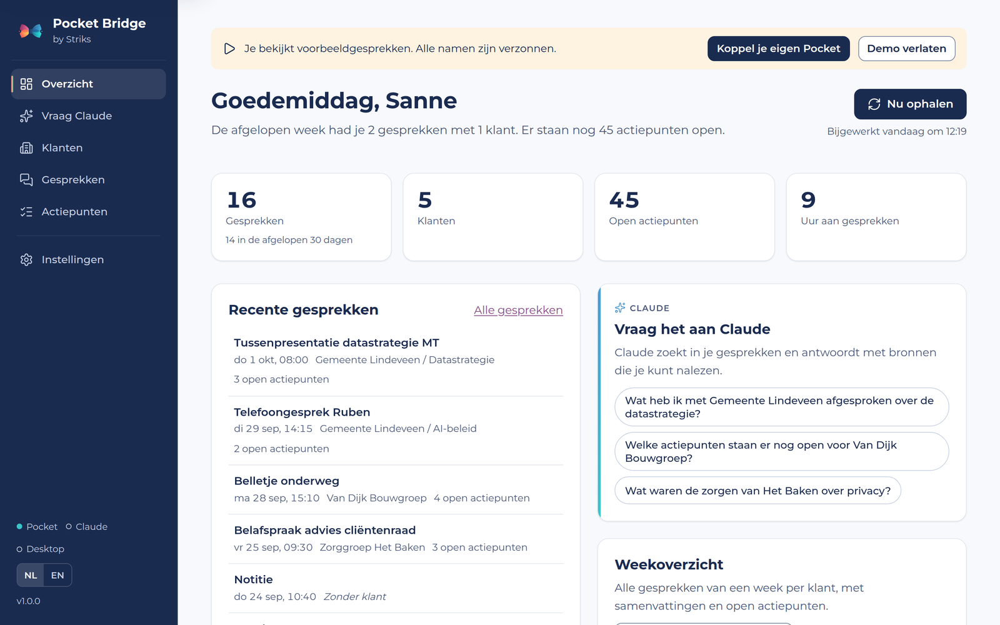
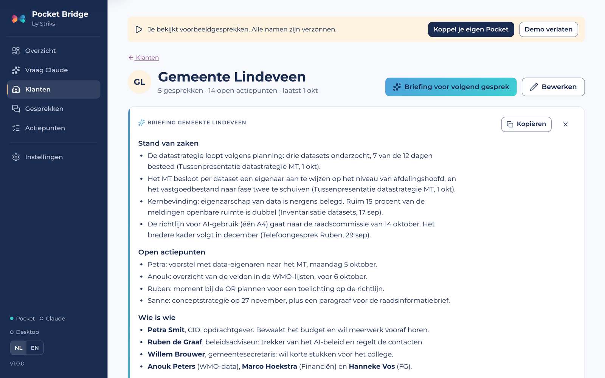
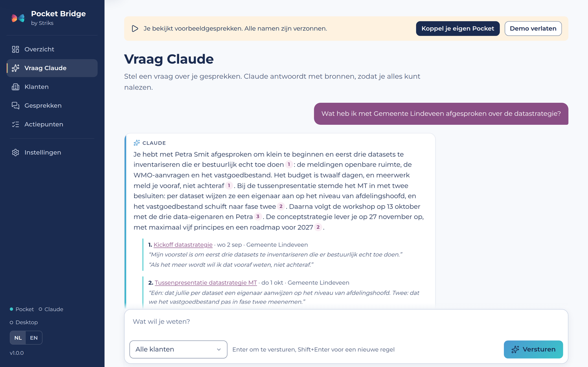
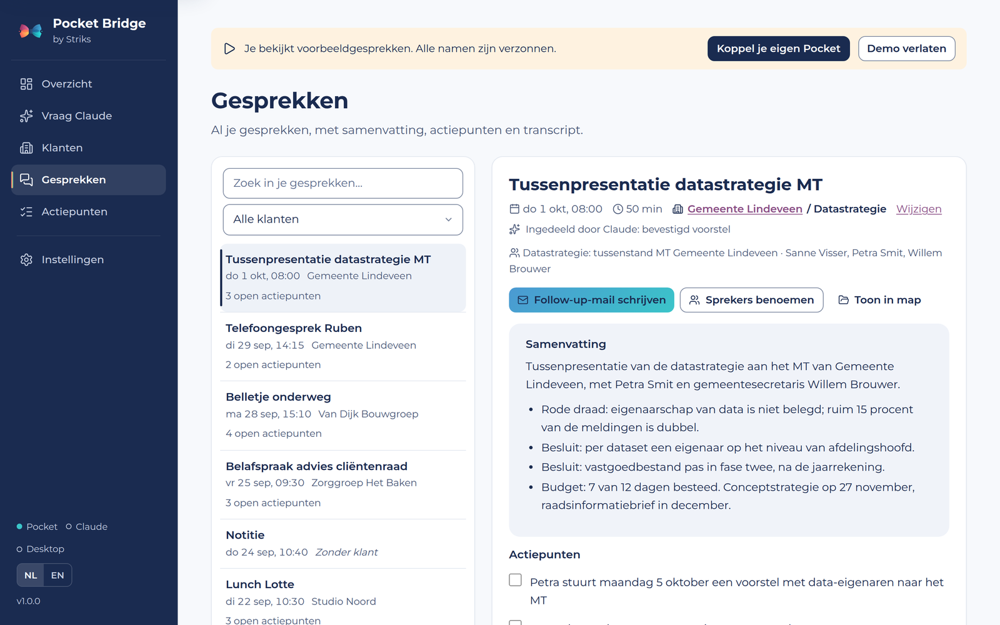

# Pocket Bridge by Striks

**Je klantgesprekken uit Pocket, vanzelf geordend per klant. Met Claude als assistent bij elk volgend gesprek.**

[English version → README.en.md](README.en.md)

- **Claude stelt je klanten voor.** Je hoeft geen klanten in te typen. Claude leest je gesprekken, stelt klanten en projecten voor, en jij beslist wat erin komt.
- **Alles staat op je eigen computer.** Per klant een map met gewone tekstbestanden, een dossier met de stand van zaken en alle actiepunten. Werkt ook als Obsidian-vault.
- **Claude helpt je verder.** Een briefing voor je volgende afspraak, een follow-up-mail na een gesprek, en antwoorden op je vragen met bronvermelding. In de app of in Claude Desktop met je eigen abonnement.



### Probeer het zonder Pocket

Op het welkomscherm kies je **Eerst rondkijken met voorbeeldgesprekken**. Je loopt dan de hele installatie door met zestien verzonnen gesprekken van een adviesbureau, inclusief het voorstel van Claude, de klantpagina's, een briefing en vragen met bronnen. Je hebt er geen Pocket en geen API-key voor nodig. De demo gebruikt een aparte map; als je hem verlaat, staat alles weer zoals het was.

### Privacy in het kort

- Je gesprekken staan als gewone bestanden op je eigen computer, in een map die jij kiest.
- Pocket Bridge leest alleen uit Pocket. Er verandert niets in je Pocket-account.
- Pocket Bridge stuurt alleen tekst naar Claude als jij een Claude-functie gebruikt, en alleen wat daarvoor nodig is. Voor het voorstellen van klanten is dat per gesprek alleen de titel, de deelnemers en een korte samenvatting.
- De app draait op je eigen computer en is alleen te openen vanuit de browser die het programma zelf opent.

---

## Installeren

### 1. Downloaden

Klik op GitHub op de groene knop **Code → Download ZIP** en pak de ZIP uit. Zet de map op een vaste plek, bijvoorbeeld in je thuismap (`~/PocketBridge` op Mac of `C:\Users\<jij>\PocketBridge` op Windows). **Laat hem niet in Downloads staan**: Claude Desktop en het automatisch starten gebruiken het programma vanuit deze map.

Of met git:

```bash
git clone https://github.com/strik88/pocket.git PocketBridge
```

### 2. Starten

| Mac | Windows |
|---|---|
| Dubbelklik op **`start-mac.command`** | Dubbelklik op **`start-windows.bat`** (zie ook [Stap voor stap op Windows](#stap-voor-stap-op-windows)) |

De eerste keer installeert het script automatisch [uv](https://docs.astral.sh/uv/) (dat regelt Python voor je) en de benodigde onderdelen. Dat duurt een paar minuten. Daarna opent je browser vanzelf en verschijnt het **strikje van Striks** in de menubalk (Mac) of bij de klok (Windows). Via dat icoon open je de app, haal je nieuwe gesprekken op of sluit je af. Het terminalvenster mag je sluiten.

> **Mac: "kan niet worden geopend"?** Klik met de rechtermuisknop op `start-mac.command` → **Open** → **Open**. Lukt het nog steeds niet, open dan Terminal in de map en typ `chmod +x start-mac.command`.
>
> **Windows: SmartScreen-melding?** Klik op **Meer informatie → Toch uitvoeren**.

### 3. De installatie doorlopen

De app leidt je in drie fases door zeven korte stappen. Reken op ongeveer tien minuten.

**Koppelen**
1. **Pocket.** In Pocket: *Settings → Developer → API Keys*. Maak een key (begint met `pk_`) en plak hem. De app test hem meteen.
2. **Claude.** Kies hoe je Claude gebruikt: met een Anthropic API-key (alles werkt in de app), met je Claude-abonnement via Claude Desktop, of nu niet. Zie [Claude: API-key of abonnement](#claude-api-key-of-abonnement).

**Inrichten**

3. **Gesprekken ophalen.** Kies de map en hoe ver terug (3 maanden, 1 jaar of alles). Je ziet de voortgang per gesprek.
4. **Claude stelt je klanten voor.** Claude groepeert je gesprekken per organisatie. Jij vinkt aan wat klopt, past namen aan, voegt samen of laat weg. Er verandert niets tot je bevestigt, en je kunt het ongedaan maken.
5. **Verdeel je gesprekken.** Wat nog geen klant heeft, deel je hier met één keuze per gesprek in, of je laat Claude een voorstel doen.

**Afmaken**

6. **Claude Desktop** koppelen met één klik (als je dat in stap 2 nog niet deed).
7. **Extra's**: automatisch ophalen, starten bij inloggen, zoeken op betekenis en je agenda.

Daarna haalt Pocket Bridge nieuwe gesprekken vanzelf op en zet ze bij de juiste klant.



---

## Stap voor stap op Windows

Reken voor de eerste keer op ongeveer 10 minuten.

**1. Downloaden**
Ga naar **github.com/Strik88/Pocket**, klik op de groene knop **Code** en kies **Download ZIP**. Er komt een bestand `Pocket-main.zip` in je map *Downloads*.

**2. Uitpakken (belangrijk)**
Klik met de **rechtermuisknop** op `Pocket-main.zip` en kies **Alles uitpakken…**. Typ als doelmap `C:\Users\<jouw naam>\PocketBridge` en klik op **Uitpakken**.
Start niets vanuit het ZIP-venster zelf: dan draait het programma vanuit een tijdelijke map en werkt de koppeling met Claude later niet.

**3. Starten**
Open de uitgepakte map (er zit een map `Pocket-main` in) en dubbelklik op **`start-windows.bat`**. Zie je geen `.bat`? Zoek dan het bestand `start-windows` met als type *Windows-batchbestand*.
- Krijg je een blauw scherm *"Windows heeft uw pc beschermd"*? Klik op **Meer informatie** en dan op **Toch uitvoeren**. Dat komt doordat het bestand van internet komt en niet door Microsoft is ondertekend.
- Er opent een zwart venster. De eerste keer worden daarin [uv](https://docs.astral.sh/uv/) en de onderdelen geïnstalleerd. Dat duurt een paar minuten; laat het venster gewoon openstaan.

**4. De app**
Je browser opent vanzelf met het welkomscherm. Rechtsonder bij de klok verschijnt het **strikje van Striks**; staat het er niet, klik dan op het pijltje **^** (verborgen pictogrammen). Via dat icoon open je de app, haal je nieuwe gesprekken op en sluit je af. Het zwarte venster sluit vanzelf.

**5. De installatie doorlopen** (zie hierboven).

**6. Claude Desktop herstarten**
Sluit Claude Desktop **helemaal** af: klik rechtsonder bij de klok met de rechtermuisknop op het Claude-icoon en kies **Quit** / **Afsluiten**. Alleen het venster sluiten is niet genoeg. Open Claude daarna opnieuw. Onder **Instellingen → Developer** zie je nu `pocket-transcripts` staan.
Pocket Bridge schrijft de koppeling zowel naar de gewone plek als naar de plek die de Microsoft Store-versie van Claude gebruikt, dus het werkt met beide installaties.

**Waar staat alles op Windows?**

| Wat | Waar |
|---|---|
| Je gesprekken | `Documenten\Pocket Transcripten` (of de map die je zelf koos) |
| Het programma | `C:\Users\<jouw naam>\PocketBridge\Pocket-main` |
| Instellingen en sleutels | `%APPDATA%\PocketBridge` (typ dit in de adresbalk van Verkenner) |
| Logbestand bij problemen | `%APPDATA%\PocketBridge\pocket-bridge.log` |

---

## Claude: API-key of abonnement

| | Met een Anthropic API-key | Met je Claude-abonnement (Pro of Max) |
|---|---|---|
| Klanten voorstellen | In de app, met kostenraming vooraf | In Claude Desktop: kies de opdracht *Stel mijn klanten voor*; het voorstel verschijnt in de app |
| Briefing, follow-up-mail, vragen met bronnen | In de app | In Claude Desktop, via de tools van Pocket Bridge |
| Kosten | Per gebruik, meestal een paar cent per gesprek | Valt onder je abonnement |

Een Claude-abonnement kan niet rechtstreeks in andere apps worden gebruikt. Daarom werkt die route via Claude Desktop: Pocket Bridge geeft Claude daar toegang tot je gesprekken. Een API-key maak je op [console.anthropic.com](https://console.anthropic.com) (zet onder Billing een paar euro tegoed). Je kunt ook allebei gebruiken.

---

## Wat je ermee kunt

### Overzicht

Wat er nieuw is, wat aandacht vraagt (gesprekken zonder klant, een voorstel van Claude, een mogelijke nieuwe klant), je cijfers en een snelle weg naar Claude.



### Klanten en dossiers

Elke klant heeft een pagina met de stand van zaken, open actiepunten en alle gesprekken per project. Met **Briefing voor volgend gesprek** leest Claude het dossier en de laatste gesprekken en krijg je de stand van zaken, open punten, wie wie is, risico's en voorstellen voor het gesprek.



### Vraag Claude

Stel vragen over al je gesprekken of die van één klant. Het antwoord verschijnt terwijl Claude schrijft, met genummerde bronnen en het letterlijke citaat erbij. Klik op een bron om het gesprek te openen.



### Gesprekken

Zoeken, lezen en verplaatsen. Bij elk gesprek zie je waarom het bij die klant staat (een regel, de agenda of Claude). Je schrijft er een **follow-up-mail** bij en geeft **sprekers** een naam; dat blijft bewaard als Pocket het gesprek later bijwerkt.



### Mappen per klant en project

```
Pocket Transcripten/
├── Klanten/
│   ├── Gemeente Lindeveen/
│   │   ├── _Dossier.md                     ← overzicht, wordt automatisch bijgewerkt
│   │   ├── _Briefings/                     ← voorbereidingen, gemaakt door Claude
│   │   ├── _Follow-ups/                    ← concept-mails na gesprekken
│   │   ├── 2026/2026-09-29 1415 Telefoongesprek Ruben.md
│   │   └── Datastrategie/                  ← project
│   │       └── 2026/2026-09-02 0930 Kickoff datastrategie.md
│   └── Van Dijk Bouwgroep/...
├── _Ongesorteerd/                          ← gesprekken zonder klant
├── _Weekoverzichten/2026-W40.md
└── .pocket-bridge/                         ← zoekindex (mag je negeren)
```

Elk bestand bevat bovenaan de gegevens (datum, duur, klant, project, afspraak, deelnemers, tags), daarna de **samenvatting**, de **actiepunten** als afvinkbare lijst en het volledige **transcript**. Zelf een bestand naar een andere klantmap slepen mag gewoon; Pocket Bridge volgt de map.

### Nog meer

- **Actiepunten**: alle open punten uit al je gesprekken, per klant. Afvinken werkt ook in het gesprek en het dossier.
- **Weekoverzicht**: alle gesprekken van een week per klant, elke vrijdagmiddag vanzelf. Met Claude erbij krijg je een korte terugblik.
- **Agenda**: plak de geheime iCal-link van Google Agenda of Outlook. Dan weet Pocket Bridge bij welke afspraak een gesprek hoort en wie erbij waren, en herkent het klanten aan hun e-maildomein.
- **Zoeken op betekenis**: vindt ook gesprekken met andere woorden voor hetzelfde. Het taalmodel (ongeveer 220 MB) draait op je eigen computer.
- **Altijd aan**: start bij inloggen, met het strikje in de menubalk of bij de klok.

---

## In Claude Desktop en Claude Code

Na het koppelen heeft Claude Desktop de tools van **pocket-transcripts**. Je hebt daarvoor geen API-key nodig. Voorbeelden:

- *"Stel mijn klanten voor met Pocket Bridge."*
- *"Bereid me voor op mijn gesprek met Van Dijk Bouwgroep morgen."*
- *"Wat heb ik deze maand met mijn klanten afgesproken, en wat staat er nog open?"*
- *"Schrijf een follow-up-mail voor het gesprek van vanochtend."*
- *"Spreker 1 in het laatste gesprek is Petra Smit."*

| Tool | Wat het doet |
|---|---|
| `list_clients`, `list_recordings` | Klanten en gesprekken per klant, project of periode |
| `search_transcripts`, `get_transcript` | Zoeken en het volledige gesprek lezen |
| `get_client_dossier` | Het klantdossier met stand van zaken |
| `open_action_items`, `complete_action_item` | Actiepunten bekijken en afvinken |
| `weekly_overview` | Alle gesprekken van een week |
| `get_speakers`, `rename_speakers` | Sprekers bekijken en een naam geven |
| `get_client_discovery_material`, `submit_client_proposal`, `apply_client_proposal` | Klanten laten voorstellen met je abonnement; jij bevestigt in de app of in de chat |
| `assign_recording`, `add_client` | Een gesprek verplaatsen, een klant toevoegen of aanvullen |
| `sync_now`, `status` | Direct ophalen; controleren of alles gekoppeld is |

In het menu van Claude Desktop staan vier kant-en-klare opdrachten: *Stel mijn klanten voor*, *Voorbereiding klant*, *Follow-up-mail* en *Weekoverzicht*. In [docs/claude-instructies.md](docs/claude-instructies.md) staan instructies die je in een Claude-project kunt plakken.

**Claude Code** (terminal): het exacte commando staat in de app onder *Instellingen → Koppelingen*, bijvoorbeeld:

```bash
claude mcp add pocket-transcripts --scope user -- /pad/naar/PocketBridge/.venv/bin/python -m pocket_bridge mcp
```

---

## Hoe het sorteren werkt

Voor elk **nieuw** gesprek, in deze volgorde:

1. **Pocket-tag** die je bij een klant hebt ingevuld.
2. **Agenda-afspraak**: een deelnemer met het e-maildomein van een klant, of de klantnaam in de titel van de afspraak.
3. **Titel** van het gesprek bevat de klantnaam of een herkenningswoord.
4. **Inhoud**: de herkenningswoorden van één klant komen duidelijk vaker voor dan die van andere klanten.
5. **Claude** (als je dat aanzet), alleen bij je bestaande klanten en alleen als het zeker genoeg is. Ziet Claude een nieuwe organisatie, dan krijg je op het overzicht een voorstel; nieuwe klanten worden nooit vanzelf aangemaakt.
6. Anders: **`_Ongesorteerd`**.

Bij elk gesprek zie je welke regel het besliste. Gesprekken die je zelf verplaatst, blijven staan.

---

## Privacy, veiligheid en kosten

- Je Pocket- en Anthropic-keys en je agenda-link staan alleen in je gebruikersmap (`~/.pocket-bridge/config.json` op Mac en Linux, `%APPDATA%\PocketBridge\config.json` op Windows), in een bestand dat alleen jij kunt lezen. Nooit in deze map of op GitHub.
- De app luistert alleen op je eigen computer (127.0.0.1) en vraagt een sessiesleutel die alleen de browser krijgt die het programma zelf opent. Andere programma's en websites kunnen je gesprekken dus niet uitlezen.
- Tekst uit gesprekken en agenda-uitnodigingen behandelt Claude altijd als gegevens, nooit als opdracht. Iemand die in een vergadering "negeer je instructies" zegt, verandert niets.
- Agenda-links komen niet in logbestanden; de agenda-cache staat buiten je (vaak gedeelde) gespreksmap.
- Zonder API-key gaat er vanuit de app niets naar Anthropic. In Claude Desktop leest Claude alleen de gesprekken die het via de tools opvraagt.
- Met een API-key kost het voorstellen van klanten meestal enkele tientallen centen voor honderd gesprekken; je ziet de raming vooraf. Briefings, follow-ups en vragen kosten een paar cent per keer. De stand van zaken per klant bijhouden staat standaard uit.

---

## Problemen oplossen

| Probleem | Oplossing |
|---|---|
| *"Pocket herkent deze key niet"* | Maak een nieuwe key in Pocket en plak hem opnieuw. Let op spaties. |
| *"Je Anthropic-account heeft nog geen tegoed"* | Zet op console.anthropic.com onder Billing een paar euro tegoed. |
| De browser zegt *"Open Pocket Bridge via het icoon"* | Klik op het strikje in de menubalk of bij de klok en kies *Open Pocket Bridge*, of start het programma opnieuw. |
| Geen icoon in de menubalk of bij de klok | Kijk in het logbestand `~/.pocket-bridge/pocket-bridge.log` (Windows: `%APPDATA%\PocketBridge\pocket-bridge.log`). |
| Claude Desktop ziet de tools niet | Sluit Claude Desktop helemaal af (Mac: Cmd+Q; Windows: rechtermuisknop op het Claude-icoon → *Quit*) en open het opnieuw. In de app zie je onder *Instellingen → Koppelingen* of Claude Desktop Pocket Bridge heeft geladen. |
| Map verplaatst na koppelen | Koppel Claude Desktop opnieuw, en zet *Start bij inloggen* uit en weer aan. |
| Agenda-test vindt 0 afspraken | Gebruik de *geheime* iCal-link (niet de openbare). Bij Outlook moet de agenda gepubliceerd zijn met details. |
| Een gesprek ontbreekt | Pocket is mogelijk nog aan het verwerken. Wacht even, of kies *Instellingen → Automatisch → Alles opnieuw ophalen uit Pocket*. |
| Bestanden handmatig verplaatst of hernoemd | *Instellingen → Over → Technische details → Alles opnieuw inlezen*. |

**Let op:** als Pocket een gesprek bijwerkt, wordt het bestand opnieuw geschreven. Afgevinkte actiepunten, sprekernamen, klant en project blijven bewaard, eigen aantekeningen in het gespreksbestand niet. Zet die in `_Dossier.md` onder **Notities**.

### Bijwerken naar een nieuwe versie

Sluit Pocket Bridge af (strikje → *Afsluiten*), download de nieuwe ZIP, pak hem uit over de oude map heen en start het startscript opnieuw. Je instellingen en gesprekken blijven bewaard, want die staan op een andere plek. Gebruikers van een eerdere versie hoeven de installatie niet opnieuw te doorlopen.

---

## Voor ontwikkelaars

```bash
uv sync --extra dev
uv run pytest
uv run pocket-bridge            # webapp
uv run pocket-bridge tray       # webapp + icoon
uv run pocket-bridge mcp        # MCP-server (stdio)
uv run pocket-bridge sync       # één keer ophalen
```

| Bestand | Wat |
|---|---|
| `pocket_api.py` | Pocket-client, tolerant voor variaties in de API |
| `sync.py`, `resort.py` | Ophalen, wegschrijven, (opnieuw) indelen met een undo-log |
| `discovery.py` | Klanten voorstellen: samenvattingen per gesprek, voorstel controleren, toepassen en terugdraaien |
| `classify.py`, `meetings.py` | Sorteren op regels en agenda (iCal) |
| `ai.py` | Alle Claude-aanroepen (structured output, citaties, kostenraming) |
| `reports.py`, `dossier.py` | Actiepunten, briefings, follow-ups, weekoverzichten, dossiers |
| `storage.py`, `index.py`, `semantic.py` | Markdown, zoekindex, zoeken op betekenis |
| `mcp_server.py` | Tools en opdrachten voor Claude Desktop en Claude Code |
| `demo.py`, `demo/` | Demo met verzonnen gesprekken |
| `web/` | Webapp (FastAPI) en frontend (JavaScript-modules zonder build-stap) |
| `tray.py`, `autostart.py`, `instance.py` | Icoon, starten bij inloggen, één instantie |

Ideeën voor uitbreidingen staan in [docs/ideeen.md](docs/ideeen.md).

---

Gemaakt door Ian Strik · [Striks AI Consulting](https://striksaiconsulting.com). Pocket Bridge is een onafhankelijk project en niet verbonden aan Pocket of Anthropic. Licentie: MIT. Lettertype Montserrat (SIL Open Font License), iconen [Lucide](https://lucide.dev) (ISC).
