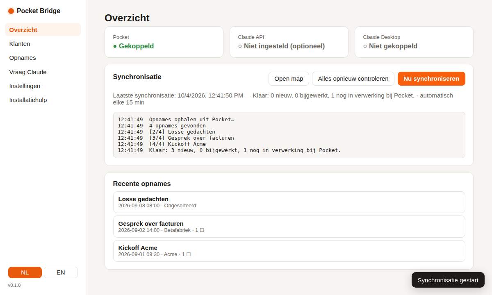
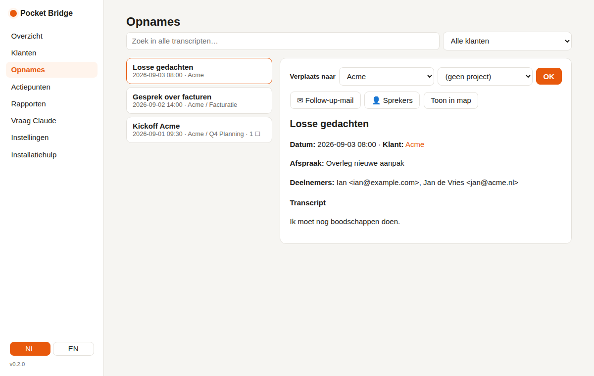
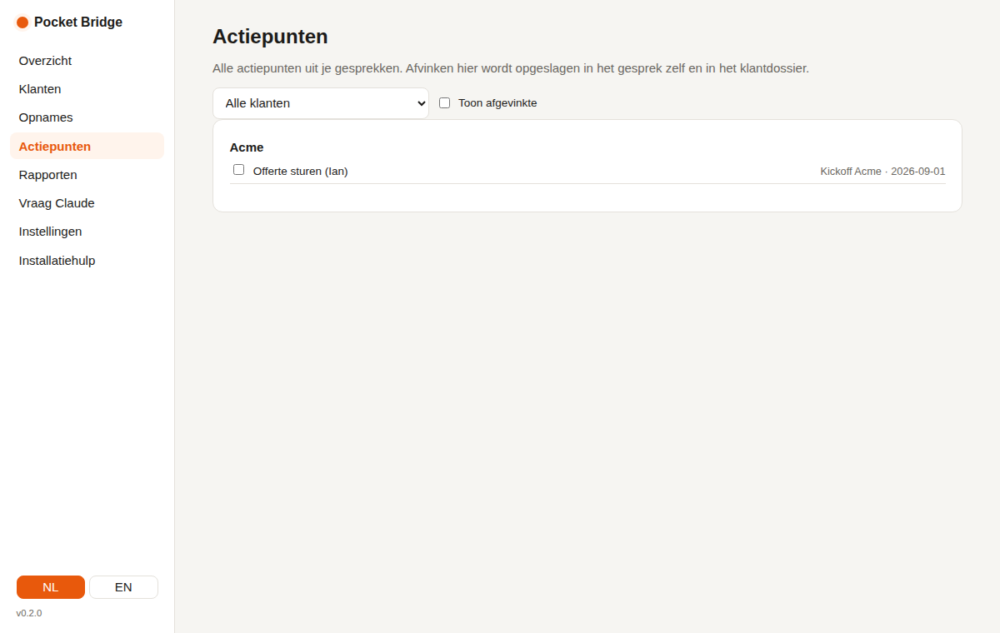
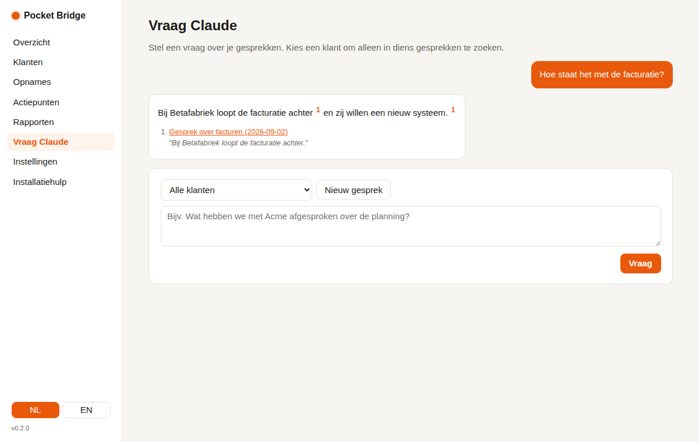

# Pocket Bridge

**Haal je Pocket-opnames naar je eigen computer, automatisch geordend per klant en project, en werk ermee samen met Claude.**

[English version → README.en.md](README.en.md)

Pocket Bridge is een klein programma dat op je eigen computer draait en:

1. **inlogt op Pocket** via de officiële Pocket API (met jouw API-key);
2. **alle transcripten ophaalt** en als nette Markdown-bestanden opslaat, met samenvatting, actiepunten, sprekers en (als je je agenda koppelt) de bijbehorende afspraak en deelnemers;
3. **per klant en per project een map maakt** en elke opname automatisch in de juiste map zet: op basis van jouw regels, je agenda, en optioneel Claude;
4. **per klant een dossier bijhoudt** met stand van zaken, alle gesprekken en openstaande actiepunten;
5. **je werk uit handen neemt**: één lijst met alle actiepunten, een voorbereidingsbriefing vóór een afspraak, een follow-up-mail ná een gesprek, en elke vrijdag een weekoverzicht;
6. **Claude toegang geeft** tot al je transcripten, in de app zelf én in Claude Desktop of Claude Code, met verwijzingen naar het gesprek waar een antwoord vandaan komt.

Alles draait lokaal. Je transcripten, je agenda-link en je sleutels blijven op je eigen computer.



---

## Snel starten

### 1. Downloaden

Klik op GitHub op de groene knop **Code → Download ZIP** en pak de ZIP uit. Zet de map op een vaste plek, bijvoorbeeld in je thuismap (`~/PocketBridge` op Mac of `C:\Users\<jij>\PocketBridge` op Windows). **Niet in Downloads laten staan**: Claude Desktop en het automatisch starten gebruiken het programma vanuit deze map.

Of met git:

```bash
git clone https://github.com/strik88/pocket.git PocketBridge
```

### 2. Starten

| Mac | Windows |
|---|---|
| Dubbelklik op **`start-mac.command`** | Dubbelklik op **`start-windows.bat`** (zie ook [Stap voor stap op Windows](#stap-voor-stap-op-windows)) |

De eerste keer installeert het script automatisch [uv](https://docs.astral.sh/uv/) (dat regelt Python voor je) en de benodigde onderdelen. Dat duurt een paar minuten. Daarna opent je browser vanzelf op **http://127.0.0.1:8765** en verschijnt er een **oranje rondje in de menubalk** (Mac) of **een icoon in het systeemvak** (Windows). Via dat icoon open je de app, synchroniseer je, zet je *Start bij inloggen* aan of sluit je af. Het terminalvenster mag je sluiten.

> **Mac: "kan niet worden geopend"?** Klik met de rechtermuisknop op `start-mac.command` → **Open** → **Open**. Lukt het nog steeds niet, open dan Terminal in de map en typ `chmod +x start-mac.command`.
>
> **Windows: SmartScreen-melding?** Klik op **Meer informatie → Toch uitvoeren**.

### 3. De installatiehulp volgen

1. **Pocket koppelen.** In Pocket: *Settings → Developer → API Keys*, maak een key aan (begint met `pk_`), plak hem en klik op *Test & opslaan*.
2. **Map kiezen** waar je transcripten komen. Standaard: `Documenten/Pocket Transcripten`.
3. **Klanten toevoegen** met herkenningswoorden, e-maildomeinen en eventueel projecten.
4. **Optioneel: Anthropic API-key** voor slim sorteren, briefings, follow-ups en vragen stellen in de app.
5. **Koppelen aan Claude Desktop** met één klik. Herstart daarna Claude Desktop.

Klik op **Nu synchroniseren** en je opnames verschijnen. Onder **Instellingen** koppel je daarna je agenda, zet je zoeken op betekenis aan en kies je of Pocket Bridge bij het inloggen start.

---

## Stap voor stap op Windows

Werk je op Windows? Volg dan deze stappen. Reken voor de eerste keer op ongeveer 10 minuten.

**1. Downloaden**
Ga naar **github.com/Strik88/Pocket**, klik op de groene knop **Code** en kies **Download ZIP**. Er komt een bestand `Pocket-main.zip` in je map *Downloads*.

**2. Uitpakken (belangrijk)**
Klik met de **rechtermuisknop** op `Pocket-main.zip` en kies **Alles uitpakken…**. Typ als doelmap `C:\Users\<jouw naam>\PocketBridge` en klik op **Uitpakken**.
Dubbelklik dus niet gewoon op de ZIP om er vanuit het ZIP-venster iets te starten: dan draait het programma vanuit een tijdelijke map en werkt de koppeling met Claude later niet.

**3. Starten**
Open de uitgepakte map (er zit een map `Pocket-main` in) en dubbelklik op **`start-windows.bat`**. Zie je geen `.bat`? Zoek dan het bestand `start-windows` met als type *Windows-batchbestand*.
- Krijg je een blauw scherm *"Windows heeft uw pc beschermd"*? Klik op **Meer informatie** en dan op **Toch uitvoeren**. Dat komt doordat het bestand van internet komt en niet door Microsoft is ondertekend.
- Er opent een zwart venster. De eerste keer worden daarin [uv](https://docs.astral.sh/uv/) (dat regelt Python voor je) en de onderdelen geïnstalleerd. Dat duurt een paar minuten; laat het venster gewoon openstaan.

**4. De app**
Je browser opent vanzelf **http://127.0.0.1:8765** met de installatiehulp. Rechtsonder in de taakbalk verschijnt een **oranje rondje**; staat het er niet, klik dan op het pijltje **^** (verborgen pictogrammen). Via dat rondje open je de app, synchroniseer je en sluit je af. Het zwarte venster sluit vanzelf.

**5. Installatiehulp volgen**
Pocket-key plakken, map kiezen, klanten toevoegen, optioneel je Anthropic-key, en op **Koppel Claude Desktop** klikken (zie [De installatiehulp volgen](#3-de-installatiehulp-volgen)).

**6. Claude Desktop herstarten**
Sluit Claude Desktop **helemaal** af: klik rechtsonder in het systeemvak met de rechtermuisknop op het Claude-icoon en kies **Quit** / **Afsluiten**. Alleen het venster sluiten is niet genoeg. Open Claude daarna opnieuw. Onder **Instellingen → Developer** zie je nu `pocket-transcripts` staan.
Pocket Bridge schrijft de koppeling zowel naar de gewone plek als naar de plek die de Microsoft Store-versie van Claude gebruikt, dus het werkt met beide installaties.

**7. Automatisch starten (aanrader)**
Vink in de app onder **Instellingen → Altijd aan** de optie **Start bij inloggen** aan. Pocket Bridge start dan elke keer als je Windows opstart, en synchroniseert op de achtergrond.

**Waar staat alles op Windows?**

| Wat | Waar |
|---|---|
| Je transcripten | `Documenten\Pocket Transcripten` (of de map die je zelf koos) |
| Het programma | `C:\Users\<jouw naam>\PocketBridge\Pocket-main` |
| Instellingen en sleutels | `%APPDATA%\PocketBridge` (typ dit in de adresbalk van Verkenner) |
| Logbestand bij problemen | `%APPDATA%\PocketBridge\pocket-bridge.log` |

**Later bijwerken naar een nieuwe versie:** sluit Pocket Bridge af (rechtermuisknop op het oranje rondje → *Afsluiten*), download de nieuwe ZIP, pak hem uit over de oude map heen en start `start-windows.bat` opnieuw. Je instellingen en transcripten blijven bewaard, want die staan op een andere plek.

---

## Wat je ermee kunt

### Mappen per klant en project

```
Pocket Transcripten/
├── Klanten/
│   ├── Acme/
│   │   ├── _Dossier.md                        ← overzicht, wordt automatisch bijgewerkt
│   │   ├── _Briefings/                        ← voorbereidingen, gemaakt door Claude
│   │   ├── _Follow-ups/                       ← concept-mails na gesprekken
│   │   ├── 2026/
│   │   │   └── 2026-09-03 0800 Overleg.md
│   │   └── Q4 Planning/                       ← project
│   │       └── 2026/2026-09-01 0930 Kickoff Acme.md
│   └── Betafabriek/...
├── _Ongesorteerd/                             ← opnames zonder duidelijke klant
├── _Weekoverzichten/2026-W36.md
└── .pocket-bridge/                            ← index en cache (mag je negeren)
```

Elk bestand bevat bovenaan metadata (datum, duur, klant, project, afspraak, deelnemers, tags), daarna de **samenvatting**, de **actiepunten** als afvinkbare lijst, en het volledige **transcript** met sprekers en tijden. De bestanden werken in elke teksteditor en direct als [Obsidian](https://obsidian.md)-vault.

**Zelf herindelen mag gewoon.** Sleep een bestand in Finder of Verkenner naar een andere klant- of projectmap; Pocket Bridge volgt de map. Of verplaats het op de pagina *Opnames*. Daarna stelt Pocket Bridge **trefwoorden voor** (namen, bedrijven, projecten die typisch zijn voor dat gesprek), zodat vergelijkbare opnames voortaan vanzelf goed komen.



### Agenda koppelen

Plak onder *Instellingen → Agenda* de **geheime iCal-link** van je agenda. Je hoeft nergens in te loggen:

- **Google Agenda:** Instellingen → klik links op je agenda → *Geheim adres in iCal-indeling*.
- **Outlook:** Instellingen → Agenda → Gedeelde agenda's → *Een agenda publiceren* → ICS-link.

Pocket Bridge zoekt bij elke opname de afspraak die op dat moment plaatsvond. De titel en deelnemers komen in het transcript, en helpen de klant te bepalen: vul bij een klant het **e-maildomein** in (bijv. `acme.nl`), dan komt elke opname van een afspraak met iemand van Acme automatisch bij Acme. De deelnemers worden ook de ontvangers van de follow-up-mail.

### Actiepunten

Op de pagina **Actiepunten** staan alle open punten uit al je gesprekken, per klant. Afvinken wordt opgeslagen in het gesprek zelf en in het klantdossier, en blijft staan als Pocket het gesprek later bijwerkt. Vink je iets af in `_Dossier.md` (bijv. in Obsidian), dan neemt Pocket Bridge dat ook over.



### Rapporten (met Claude)

- **Voorbereiding op een gesprek**: Claude leest het dossier en de laatste drie gesprekken en maakt een briefing: stand van zaken, open punten, betrokken personen, risico's en voorstellen voor het gesprek. Ook via de knop *Briefing* bij een klant.
- **Follow-up-mail**: bij elk gesprek een concept-mail (bedankje, samenvatting, afspraken, actiepunten), die je aanpast en met één klik in je mailprogramma opent.
- **Weekoverzicht**: alle gesprekken van een week per klant, met samenvattingen en open punten, plus een korte terugblik van Claude. Wordt **elke vrijdagmiddag automatisch** gemaakt; een gemiste week wordt de week erna alsnog gemaakt. Werkt ook zonder Claude (dan zonder terugblik).
- **Stand van zaken**: na nieuwe gesprekken werkt Claude per klant een korte statusnotitie bij, bovenaan het dossier.

### Sprekers een naam geven

Pocket noemt sprekers vaak "Speaker 1". Klik bij een opname op **Sprekers** en vul de namen in, of laat Claude ze raden aan de hand van het gesprek en de agenda-deelnemers. De namen blijven bewaard, ook als Pocket het gesprek later bijwerkt.

### Zoeken op betekenis

Zet onder *Instellingen* **Zoeken op betekenis** aan. Je vindt dan ook gesprekken waarin andere woorden zijn gebruikt, bijvoorbeeld "betalingsachterstand" als je zoekt op "facturen". Het meertalige taalmodel (~220 MB) wordt één keer gedownload en draait daarna volledig op je eigen computer; er gaat niets naar buiten. Het werkt samen met het gewone zoeken, dus exacte namen blijven bovenaan komen.

### Vragen stellen

Op de pagina **Vraag Claude** stel je vragen over al je gesprekken of die van één klant. Het antwoord verschijnt terwijl Claude schrijft, met **genummerde bronverwijzingen**: beweeg over een nummer voor het letterlijke citaat, klik om het gesprek te openen.



### Altijd aan

Vink onder *Instellingen* (of in het menu van het icoon) **Start bij inloggen** aan. Pocket Bridge start dan op de achtergrond zodra je inlogt, met het icoon in de menubalk/het systeemvak, en synchroniseert vanzelf. Start je het programma per ongeluk twee keer, dan opent de tweede keer gewoon de bestaande app.

---

## In Claude Desktop en Claude Code

Na het koppelen (stap 5) heeft Claude Desktop de tools van **pocket-transcripts**. Je hebt daarvoor geen Anthropic API-key nodig; Claude Desktop doet het denkwerk zelf. Voorbeelden:

- *"Welke klanten heb ik en wanneer sprak ik ze voor het laatst?"*
- *"Zoek in mijn gesprekken waar het over de begroting van 2027 ging."*
- *"Geef me alle openstaande actiepunten voor Acme. Vink 'offerte sturen' af."*
- *"Bereid me voor op mijn gesprek met Betafabriek morgen."*
- *"Schrijf een follow-up-mail voor het gesprek van vanochtend."*
- *"Spreker 1 in het laatste gesprek is Jan de Vries."*
- *"Het gesprek 'Losse gedachten' hoort bij Acme, project Phoenix."*

| Tool | Wat het doet |
|---|---|
| `list_clients` | Klanten met projecten, aantal gesprekken, laatste contact, open actiepunten |
| `list_recordings` | Opnames per klant, project of periode |
| `search_transcripts` | Zoeken (op woorden, en op betekenis als dat aanstaat) |
| `get_transcript` | Het volledige gesprek, inclusief afspraak en deelnemers |
| `get_client_dossier` | Het klantdossier met stand van zaken |
| `open_action_items` / `complete_action_item` | Actiepunten bekijken en afvinken |
| `weekly_overview` | Alle gesprekken van een week |
| `get_speakers` / `rename_speakers` | Sprekers bekijken en een naam geven |
| `assign_recording` | Opname naar een (nieuwe) klant of project verplaatsen, met voorgestelde trefwoorden |
| `add_client` | Klant toevoegen of trefwoorden, e-maildomeinen en projecten aanvullen |
| `sync_now`, `status` | Direct ophalen; controleren of alles gekoppeld is |

In Claude Desktop staan ook drie **kant-en-klare prompts** in het menu: *Voorbereiding klant*, *Follow-up-mail* en *Weekoverzicht*. In [docs/claude-instructies.md](docs/claude-instructies.md) staan instructies die je in een Claude-project kunt plakken.

**Claude Code** (terminal): het exacte commando staat in de installatiehulp onder stap 5, bijvoorbeeld:

```bash
claude mcp add pocket-transcripts --scope user -- /pad/naar/PocketBridge/.venv/bin/python -m pocket_bridge mcp
```

**Ook de officiële Pocket MCP?** Pocket heeft een eigen MCP-server (`https://public.heypocketai.com/mcp`) die live in je Pocket-account zoekt. Die kun je ernaast gebruiken via *Instellingen → Connectors → Custom connector toevoegen*.

---

## Hoe het sorteren werkt

Voor elke **nieuwe** opname, in deze volgorde:

1. **Pocket-tag** die je bij een klant hebt ingevuld.
2. **Agenda-afspraak**: een deelnemer met het e-maildomein van een klant, of de klantnaam/een trefwoord in de titel van de afspraak.
3. **Titel** van de opname bevat de klantnaam of een trefwoord.
4. **Inhoud**: de trefwoorden van één klant komen minstens 2× voor (en duidelijk vaker dan die van andere klanten). Het minimum stel je in.
5. **Claude** (alleen met Anthropic API-key en als het aanstaat), alleen als het zeker genoeg is.
6. Anders: **`_Ongesorteerd`**.

Daarna kiest Pocket Bridge binnen de klant een **project** als de projectnaam of een projecttrefwoord in de titel, de afspraak of (vaak genoeg) in het gesprek staat. Bestaande opnames worden nooit automatisch verplaatst.

---

## Privacy en kosten

- Je Pocket- en Anthropic-keys en je agenda-link staan alleen in je gebruikersmap (`~/.pocket-bridge/config.json` op Mac/Linux, `%APPDATA%\PocketBridge\config.json` op Windows), nooit in deze map of op GitHub.
- De webpagina is alleen bereikbaar vanaf je eigen computer (127.0.0.1).
- Zoeken op betekenis draait volledig lokaal.
- Zonder Anthropic API-key gaat er niets naar Anthropic vanuit Pocket Bridge. In Claude Desktop leest Claude de transcripten die het via de tools opvraagt, net als elk ander document dat je deelt.
- Met Anthropic API-key kosten sorteren, stand van zaken en follow-ups een paar cent per gesprek, een briefing of weekoverzicht iets meer. Vragen in de app kosten afhankelijk van hoeveel gesprekken worden meegelezen. Het model is instelbaar (standaard `claude-opus-5-5`); elke functie met Claude kun je uitzetten.

---

## Problemen oplossen

| Probleem | Oplossing |
|---|---|
| *"Pocket weigert de API-key"* | Maak een nieuwe key aan in Pocket en plak hem opnieuw. Let op spaties. |
| Geen icoon in de menubalk / het systeemvak | Kijk in het logbestand `~/.pocket-bridge/pocket-bridge.log` (Windows: `%APPDATA%\PocketBridge\pocket-bridge.log`). De app werkt ook zonder icoon op http://127.0.0.1:8765. |
| Claude Desktop ziet de tools niet | Herstart Claude Desktop volledig (Mac: Cmd+Q; Windows: rechtermuisknop op het Claude-icoon in het systeemvak → *Quit*). Controleer onder *Instellingen → Developer* of `pocket-transcripts` draait. Klik zo nodig nog een keer op *Koppel Claude Desktop*. |
| Windows: het zwarte venster sluit meteen of meldt een fout | Controleer of je de ZIP met *Alles uitpakken* hebt uitgepakt en niet vanuit het ZIP-venster start. Start `start-windows.bat` opnieuw; kijk anders in `%APPDATA%\PocketBridge\pocket-bridge.log`. |
| Map verplaatst na koppelen | Klik opnieuw op *Koppel Claude Desktop*, en zet *Start bij inloggen* uit en weer aan. |
| Agenda-test vindt 0 afspraken | Controleer of je de *geheime* iCal-link gebruikt (niet de openbare). Bij Outlook moet de agenda gepubliceerd zijn met details. |
| Zoeken op betekenis: model downloaden mislukt | Controleer je internetverbinding en klik op *Index nu bijwerken*. Gewoon zoeken blijft intussen werken. |
| Opname staat er niet | Pocket is mogelijk nog aan het verwerken. Wacht even en synchroniseer opnieuw, of kies *Alles opnieuw controleren*. |
| Bestanden handmatig verplaatst of hernoemd | *Instellingen → Index & dossiers opnieuw opbouwen*. |
| Iets ziet er vreemd uit in een transcript | De ruwe Pocket-data staat in `.pocket-bridge/raw/<id>.json`. Handig om mee te sturen bij een bugmelding. |

**Let op:** als Pocket een gesprek bijwerkt, wordt het bestand opnieuw geschreven. Afgevinkte actiepunten, sprekernamen, klant en project blijven bewaard, maar eigen aantekeningen in het gespreksbestand zelf niet. Zet die in `_Dossier.md` onder **Notities**.

---

## Delen met anderen

Stuur iemand de link naar deze GitHub-repository. Ze downloaden de ZIP, dubbelklikken op het startscript en volgen de installatiehulp met hun eigen Pocket-key. Er zitten geen persoonlijke gegevens in de code.

## Voor ontwikkelaars

```bash
uv sync --extra dev
uv run pytest
uv run pocket-bridge            # webapp
uv run pocket-bridge tray       # webapp + icoon
uv run pocket-bridge mcp        # MCP-server (stdio)
uv run pocket-bridge sync       # één keer synchroniseren
```

| Bestand | Wat |
|---|---|
| `pocket_api.py` | Pocket-client, tolerant voor variaties in de API |
| `sync.py` | Ophalen, wegschrijven, verplaatsen, sprekers |
| `classify.py`, `meetings.py` | Sorteren op regels en agenda (iCal) |
| `ai.py` | Alle Claude-aanroepen (classificeren, briefing, follow-up, terugblik, status, vragen met bronnen) |
| `reports.py` | Actiepunten, briefings, follow-ups, weekoverzichten, trefwoord-suggesties |
| `storage.py`, `dossier.py`, `index.py`, `semantic.py` | Markdown, dossiers, zoekindex, zoeken op betekenis |
| `mcp_server.py` | Tools en prompts voor Claude Desktop/Code |
| `web/`, `tray.py`, `autostart.py`, `instance.py` | Webapp, icoon, starten bij inloggen, één instantie |

Ideeën voor uitbreidingen staan in [docs/ideeen.md](docs/ideeen.md).

Pocket Bridge is een onafhankelijk project en niet verbonden aan Pocket of Anthropic. Licentie: MIT.
